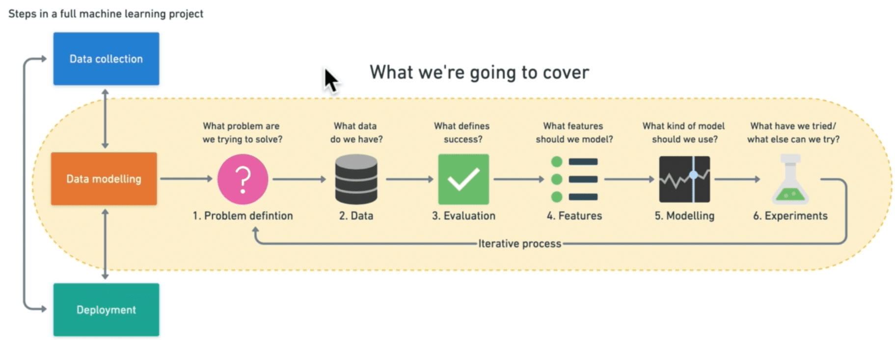

# zerotomastery-complete-machine-learning-and-data-science

## 1.1 Course Outline

  

  

  

  

## 2.1. What Is Machine Learning

  

  

  

## 2.4. How Did We Get Here

  

## 2.5. Exercise

  

## 2.6. Types of Machine Learning

  

## 2.8. What Is Machine Learning

  

  

  

  

## 2.9. Section Review

  

