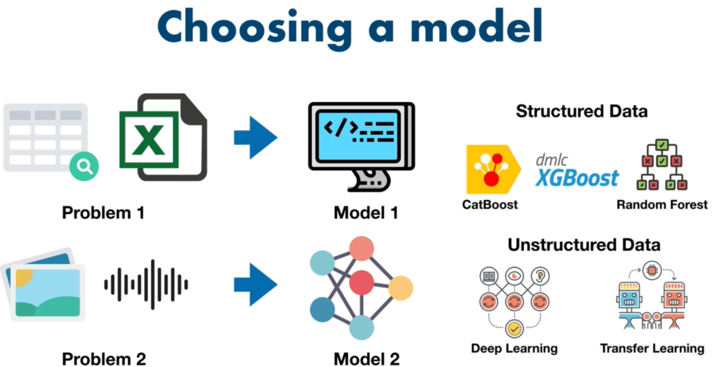

# zerotomastery-complete-machine-learning-and-data-science

## 1.1 Course Outline

  

  
  

  

## 2.1. What Is Machine Learning

  
  
  

## 2.4. How Did We Get Here

  

## 2.6. Types of Machine Learning

  

## 2.8. What Is Machine Learning

  
  

  
  

## 2.9. Section Review

  

## 3.1. Section Overview

  
  

## 3.3 [6 Steps](https://www.mrdbourke.com/a-6-step-field-guide-for-building-machine-learning-projects/) Machine Learning Framework

  
  

  
  

  
  

## 3.4. Types of Machine Learning Problems

  

  
  

  
  

  
  

  
  

## 3.5. Types of Data

  
  

  
  

## 3.6. Types of Evaluation

  
  

  
  

## 3.7. Features In Data

  
  

  
  

## 3.8. Modelling - Splitting Data

  
  

  
  

## 3.9. Modelling - Picking the Model

  

  
  

  
  

